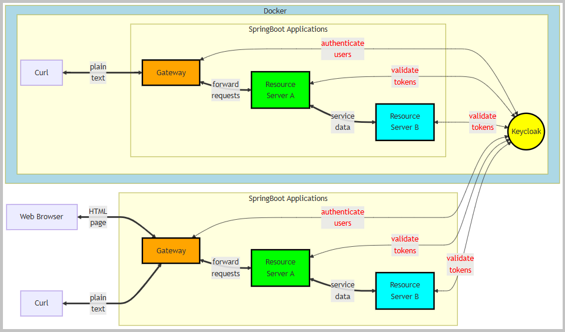
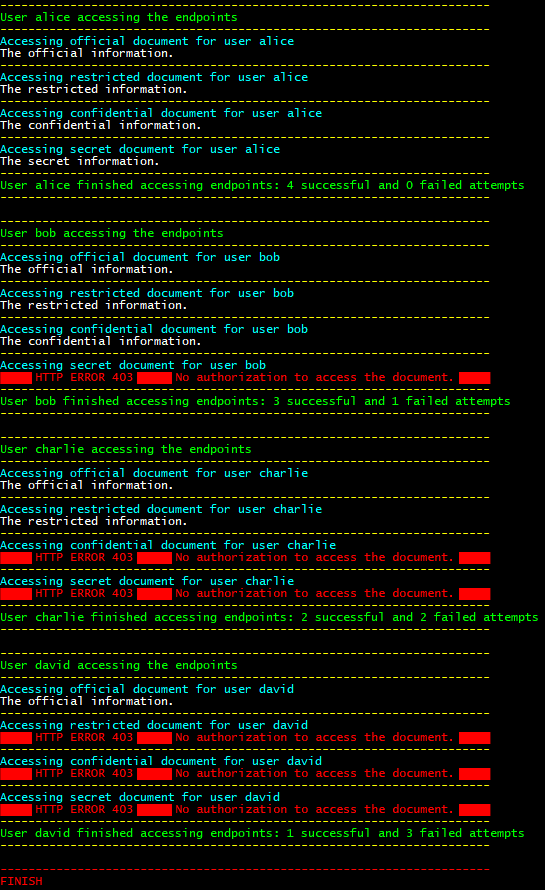

<!DOCTYPE html>
<html lang="en">
<meta charset="UTF-8">
<body>

<h2 id="contents">Study23 README Contents</h2>

<h3 id="top">Research <a href="https://www.keycloak.org/getting-started/getting-started-docker">Keycloak</a>
    and <a href="https://docs.spring.io/spring-cloud-gateway/reference/">Spring Cloud Gateway</a></h3>

    Authorization decisions are delegated to Keycloak, an OAuth 2.0-compliant authorization server.

    This project includes three Spring Boot applications, each tailored to specific roles within the architecture:

<ol>
    <li><i>gateway</i> - serves as both an OAuth2 Client and an OAuth2 Resource Server,
        managing access and routing requests to downstream services.</li>
    <li><i>resource-server-a</i> - functions as an OAuth2 Resource Server,
        providing secure access to its protected resources.</li>
    <li><i>resource-server-b</i> - operates as an OAuth2 Resource Server for <i>resource-server-a</i>,
        enabling hierarchical resource access.</li>
</ol>

    Sections of this project:

<ol>
    <li><a href="#ONE"><b>Docker Build</b></a></li>
    <li><a href="#TWO"><b>Curl Client on Docker</b></a></li>
    <li><a href="#THREE"><b>Local Build</b></a></li>
    <li><a href="#FOUR"><b>Local Curl Client</b></a></li>
    <li><a href="#FIVE"><b>Web Browser Client</b></a></li>
</ol>

    Java source code packages: 
     
    
    <i>project 'Study23-gateway', application sources</i>&nbsp;:&nbsp;
    <a href="https://github.com/k1729p/Study23/tree/main/gateway/src/main/java/kp">kp</a> 
    
    <i>project 'Study23-gateway', test sources</i>&nbsp;:&nbsp;
    <a href="https://github.com/k1729p/Study23/tree/main/gateway/src/test/java/kp">kp</a> 
    
    <i>project 'Study23-resource-server-a', application sources</i>&nbsp;:&nbsp;
    <a href="https://github.com/k1729p/Study23/tree/main/resource-server-a/src/main/java/kp">kp</a> 
    
    <i>project 'Study23-resource-server-a', test sources</i>&nbsp;:&nbsp;
    <a href="https://github.com/k1729p/Study23/tree/main/resource-server-a/src/test/java/kp">kp</a> 
    
    <i>project 'Study23-resource-server-b', application sources</i>&nbsp;:&nbsp;
    <a href="https://github.com/k1729p/Study23/tree/main/resource-server-b/src/main/java/kp">kp</a> 
    
    <i>project 'Study23-resource-server-b', test sources</i>&nbsp;:&nbsp;
    <a href="https://github.com/k1729p/Study23/tree/main/resource-server-b/src/test/java/kp">kp</a> 
    

     
    
    <i>project 'Study23-gateway'</i>&nbsp;:&nbsp;
    <a href="https://htmlpreview.github.io/?https://github.com/k1729p/Study23/blob/main/gateway/docs/apidocs/index.html">
        Java API Documentation</a>&nbsp;●&nbsp;
    <a href="https://htmlpreview.github.io/?https://raw.githubusercontent.com/k1729p/Study23/main/gateway/docs/testapidocs/kp/gateway/package-summary.html">
        Java Test API Documentation</a> 
    
    <i>project 'Study23-resource-server-a'</i>&nbsp;:&nbsp;
    <a href="https://htmlpreview.github.io/?https://github.com/k1729p/Study23/blob/main/resource-server-a/docs/apidocs/overview-tree.html">
        Java API Documentation</a>&nbsp;●&nbsp;
    <a href="https://htmlpreview.github.io/?https://raw.githubusercontent.com/k1729p/Study23/main/resource-server-a/docs/testapidocs/kp/resource/server/a/controllers/package-summary.html">
        Java Test API Documentation</a> 
    
    <i>project 'Study23-resource-server-b'</i>&nbsp;:&nbsp;
    <a href="https://htmlpreview.github.io/?https://github.com/k1729p/Study23/blob/main/resource-server-b/docs/apidocs/overview-tree.html">
        Java API Documentation</a>&nbsp;●&nbsp;
    <a href="https://htmlpreview.github.io/?https://raw.githubusercontent.com/k1729p/Study23/main/resource-server-b/docs/testapidocs/kp/resource/server/b/controllers/package-summary.html">
        Java Test API Documentation</a> 
    

<h3 id="ONE">❶ Docker Build</h3>

Action: 
     
     Use the batch file
    <a href="https://github.com/k1729p/Study23/blob/main/0_batch/01%20Docker%20compose.bat">
        <i>"01 Docker compose.bat"</i></a> to build the images and 
    start the containers. 
    

    1.1. Docker images are built using the following files:

<ul>
    <li><a href="https://raw.githubusercontent.com/k1729p/Study23/main/docker-config/Gateway.Dockerfile">
        <b>Gateway.Dockerfile</b></a></li>
    <li><a href="https://raw.githubusercontent.com/k1729p/Study23/main/docker-config/Resource-Server-A.Dockerfile">
        <b>Resource-Server-A.Dockerfile</b></a></li>
    <li><a href="https://raw.githubusercontent.com/k1729p/Study23/main/docker-config/Resource-Server-B.Dockerfile">
        <b>Resource-Server-B.Dockerfile</b></a></li>
    <li><a href="https://raw.githubusercontent.com/k1729p/Study23/main/docker-config/compose.yaml">
        <b>compose.yaml</b></a></li>
</ul>

    The <a href="images/ScreenshotDockerContainers.png">screenshot</a>
    shows the created Docker containers.

    1.2. The resource servers manage documents classified under four classification levels.
    Four users are assigned specific roles corresponding to their access levels.

    

    1.3. Keycloak realm 'spring' configuration: 

<ul>
    <li>The <a href="images/ScreenshotKeycloakROLE_OFFICIAL.png">screenshot</a>
        shows the 'ROLE_OFFICIAL' settings.</li>
    <li>The <a href="images/ScreenshotKeycloakROLE_RESTRICTED.png">screenshot</a>
        shows the 'ROLE_RESTRICTED' settings.</li>
    <li>The <a href="images/ScreenshotKeycloakROLE_CONFIDENTIAL.png">screenshot</a>
        shows the 'ROLE_CONFIDENTIAL' settings.</li>
    <li>The <a href="images/ScreenshotKeycloakROLE_SECRET.png">screenshot</a>
        shows the 'ROLE_SECRET' settings.</li>
    <li>The <a href="images/ScreenshotKeycloakUsers.png">screenshot</a>
        shows the 'Users' settings.</li>
    <li>The <a href="images/ScreenshotKeycloakUsersRoleMapping.png">screenshot</a>
        shows the 'Users Role Mapping' settings.</li>
</ul>

<a href="#top">Back to the top of the page</a>

<h3 id="TWO">❷ Curl Client on Docker</h3>

Action: 
     
     Use the batch file
    <a href="https://github.com/k1729p/Study23/blob/main/0_batch/02%20CURL%20on%20Docker.bat">
        <i>"02 CURL on Docker.bat"</i></a> to build and start the 'REST client' container with tests. 
    

    2.1. Docker script: <a href="https://raw.githubusercontent.com/k1729p/Study23/refs/heads/main/docker-config/tests/Rest-Client.Dockerfile">
        Rest-Client.Dockerfile</a>.

    2.2. Shell script with tests: <a href="https://raw.githubusercontent.com/k1729p/Study23/refs/heads/main/docker-config/tests/call_endpoints.sh">
        call_endpoints.sh</a>.

     
    
    <i>Screenshot of the console log from the batch file "02 CURL on Docker.bat".</i>

<a href="#top">Back to the top of the page</a>

<h3 id="THREE">❸ Local Build</h3>

Action: 
     
     Use the batch file
    <a href="https://github.com/k1729p/Study23/blob/main/0_batch/03%20MVN%20build%20and%20start%20local.bat">
        <i>"03 MVN build and start local.bat"</i></a> to build and 
    
    &nbsp; start locally the 'gateway', 'resource server a', and 'resource server b'. 
    

<a href="#top">Back to the top of the page</a>

<h3 id="FOUR">❹ Local Curl Client</h3>

Action: 
     
     Start the Windows batch script
    <a href="https://github.com/k1729p/Study23/blob/main/0_batch/04%20CURL%20on%20local.bat">
        <i>"04 CURL on local.bat"</i></a>. 
    

    4.1. The <a href="images/ScreenshotCurlLocal.png">screenshot</a>
    shows the console log from the batch file "04 CURL on local.bat". 

<a href="#top">Back to the top of the page</a>

<h3 id="FIVE">❺ Web Browser Client</h3>

Action: 
     
     Open the file
    <a href="https://github.com/k1729p/Study23/blob/main/0_batch/Links.html">Links.html</a> in a web browser. 
    

    5.1. The GitHub preview in a browser of the page
    <a href="https://htmlpreview.github.io/?https://github.com/k1729p/Study23/blob/main/0_batch/Links.html">
        Links</a>.

    5.2. The <a href="images/ScreenshotKeycloakLoginAuthentication.png">screenshot</a>
    shows Keycloak's login authentication page.

    These document endpoints use the <code>@PreAuthorize</code> annotation to enforce role-based access control,
    requiring the roles defined in the Keycloak realm 'spring'.

    5.3.1. The <b>Official Document</b> endpoints:

<ol>
    <li>On Docker
        <ul>
            <li>'http://localhost:8081/api/document/official'</li>
        </ul>
    </li>
    <li>Local
        <ul>
            <li>'http://localhost:9091/api/document/official'</li>
            <li>'http://localhost:9091/api/document/official/html'</li>
        </ul>
    </li>
</ol>

    The controller method:
    <a href="https://github.com/k1729p/Study23/blob/main/resource-server-a/src/main/java/kp/resource/server/a/controllers/DocumentController.java#L49">
        kp.resource.server.a.controllers.DocumentController::getOfficialDocument</a>. 

    The <a href="images/ScreenshotOfficialDocument.png">screenshot</a>
    shows the result from the endpoint 'http://localhost:9091/api/document/official/html'.

    The service method:
    <a href="https://github.com/k1729p/Study23/blob/main/resource-server-a/src/main/java/kp/resource/server/a/services/DocumentService.java#L41">
        kp.resource.server.a.services.DocumentService::findDocument</a>. 

    The controller method in the 'resource-server-b' module:
    <a href="https://github.com/k1729p/Study23/blob/main/resource-server-b/src/main/java/kp/resource/server/b/controllers/DocumentController.java#L49">
        kp.resource.server.b.controllers.DocumentController::getOfficialDocument</a>. 

    5.3.2. The <b>Restricted Document</b> endpoints:

<ol>
    <li>On Docker
        <ul>
            <li>'http://localhost:8081/api/document/restricted'</li>
        </ul>
    </li>
    <li>Local
        <ul>
            <li>'http://localhost:9091/api/document/restricted'</li>
            <li>'http://localhost:9091/api/document/restricted/html'</li>
        </ul>
    </li>
</ol>

    The controller method:
    <a href="https://github.com/k1729p/Study23/blob/main/resource-server-a/src/main/java/kp/resource/server/a/controllers/DocumentController.java#L72">
        kp.resource.server.a.controllers.DocumentController::getRestrictedDocument</a>. 

    The <a href="images/ScreenshotRestrictedDocument.png">screenshot</a>
    shows the result from the endpoint 'http://localhost:9091/api/document/restricted/html'. 

    5.3.3. The <b>Confidential Document</b> endpoints:

<ol>
    <li>On Docker
        <ul>
            <li>'http://localhost:8081/api/document/confidential'</li>
        </ul>
    </li>
    <li>Local
        <ul>
            <li>'http://localhost:9091/api/document/confidential'</li>
            <li>'http://localhost:9091/api/document/confidential/html'</li>
        </ul>
    </li>
</ol>

    The controller method:
    <a href="https://github.com/k1729p/Study23/blob/main/resource-server-a/src/main/java/kp/resource/server/a/controllers/DocumentController.java#L95">
        kp.resource.server.a.controllers.DocumentController::getConfidentialDocument</a>. 

    The <a href="images/ScreenshotConfidentialDocument.png">screenshot</a>
    shows the result from the endpoint 'http://localhost:9091/api/document/confidential/html'. 

    5.3.4. The <b>Secret Document</b> endpoints:

<ol>
    <li>On Docker
        <ul>
            <li>'http://localhost:8081/api/document/secret'</li>
        </ul>
    </li>
    <li>Local
        <ul>
            <li>'http://localhost:9091/api/document/secret'</li>
            <li>'http://localhost:9091/api/document/secret/html'</li>
        </ul>
    </li>
</ol>

    The controller method:
    <a href="https://github.com/k1729p/Study23/blob/main/resource-server-a/src/main/java/kp/resource/server/a/controllers/DocumentController.java#L118">
        kp.resource.server.a.controllers.DocumentController::getSecretDocument</a>. 

    The <a href="images/ScreenshotSecretDocument.png">screenshot</a>
    shows the result from the endpoint 'http://localhost:9091/api/document/secret/html'. 

    5.4.1. The <b>Gateway</b> endpoint: 'http://localhost:9091/'.

    The <a href="images/ScreenshotGateway.png">screenshot</a>
    shows the result from the endpoint 'http://localhost:9091/'. 

    5.4.2. The <b>Gateway Information</b> endpoint: 'http://localhost:9091/info'.

    The controller method:
    <a href="https://github.com/k1729p/Study23/blob/main/gateway/src/main/java/kp/gateway/controllers/GatewayInfoController.java#L114">
        kp.gateway.controllers.GatewayInfoController::info</a>. 

    The <a href="images/ScreenshotGatewayInformation.png">screenshot</a>
    shows the result from the endpoint 'http://localhost:9091/info'. 

    5.4.3. The <b>Resource Server Information</b> endpoint: 'http://localhost:9091/api/info'.

    The controller method:
    <a href="https://github.com/k1729p/Study23/blob/main/resource-server-a/src/main/java/kp/resource/server/a/controllers/ResourceServerInfoController.java#L94">
        kp.resource.server.a.controllers.ResourceServerInfoController::info</a>. 

    The <a href="images/ScreenshotResourceServerInformation.png">screenshot</a>
    shows the result from the endpoint 'http://localhost:9091/api/info'. 

<a href="#top">Back to the top of the page</a>

<h3>Description</h3>

    The system leverages the following key technologies:

<ul>
    <li><b>Spring Cloud Gateway</b> - facilitates intelligent routing and
        load balancing for incoming requests. It also supports the
        <b>OAuth2 Backend for Frontend</b> pattern, acting as middleware
        between the frontend and REST APIs. The BFF bridges:
        <ul>
            <li>Request authorization using a session cookie (with the frontend)</li>
            <li>Authorization using a Bearer token (as expected by resource servers)</li>
        </ul>
    </li>
    <li><b>Keycloak</b> - handles authentication and authorization,
        acting as the central Identity Provider (IdP).</li>
    <li><b>OAuth2</b> - provides a secure framework for authorization,
        allowing users and applications to access resources with fine-grained permissions.
        <a href="https://oauth.net/id-tokens-vs-access-tokens/">
            ID Tokens versus Access Tokens</a>.</li>
    <li><b><a href="https://github.com/jwtk/jjwt?tab=readme-ov-file#what-is-a-json-web-token">
        JSON Web Tokens</a></b> - used by Keycloak to issue access tokens,
        enabling stateless authentication and secure information exchange between clients and servers.</li>
</ul>

    Access tokens are securely generated by Keycloak, adhering to the OAuth2 protocol,
    to facilitate authenticated API interactions. These tokens, encoded as JWTs, carry claims and metadata
    required for authorization decisions while ensuring tamper-proof integrity.

    A "gateway" (a.k.a. "reverse proxy"), as defined by <b>RFC 9110</b>, is an intermediary
    that acts as an origin server for the outbound connection but translates received requests
    and forwards them inbound to another server.

<h3>Acronyms</h3>
<table style="border:solid">
    <tbody>
    <tr><td style="border:solid"><b>ACME</b></td><td style="border:solid">Automatic Certificate Management Environment</td></tr>
    <tr><td style="border:solid"><b>BFF</b></td><td style="border:solid">Backend for Frontend</td></tr>
    <tr><td style="border:solid"><b>CSRF</b></td><td style="border:solid">Cross-Site Request Forgery</td></tr>
    <tr><td style="border:solid"><b>CORS</b></td><td style="border:solid">Cross-Origin Resource Sharing</td></tr>
    <tr><td style="border:solid"><b>JWS</b></td><td style="border:solid">JSON Web Signature</td></tr>
    <tr><td style="border:solid"><b>JWT</b></td><td style="border:solid">JSON Web Token</td></tr>
    <tr><td style="border:solid"><b>OIDC</b></td><td style="border:solid">OpenID Connect</td></tr>
    <tr><td style="border:solid"><b>PKCE</b></td><td style="border:solid">Proof of Key Code Exchange</td></tr>
    <tr><td style="border:solid"><b>RBAC</b></td><td style="border:solid">Role-based Access Control</td></tr>
    <tr><td style="border:solid"><b>RPT</b></td><td style="border:solid">Requesting Party Token</td></tr>
    <tr><td style="border:solid"><b>SAML</b></td><td style="border:solid">Security Assertion Markup Language</td></tr>
    <tr><td style="border:solid"><b>SPA</b></td><td style="border:solid">Single Page Application</td></tr>
    <tr><td style="border:solid"><b>SSL</b></td><td style="border:solid">Secure Sockets Layer</td></tr>
    <tr><td style="border:solid"><b>TLS</b></td><td style="border:solid">Transport Layer Security</td></tr>
    <tr><td style="border:solid"><b>UMA</b></td><td style="border:solid">User-Managed Access</td></tr>
    </tbody>
</table>

<a href="#top">Back to the top of the page</a>

</body>
</html>