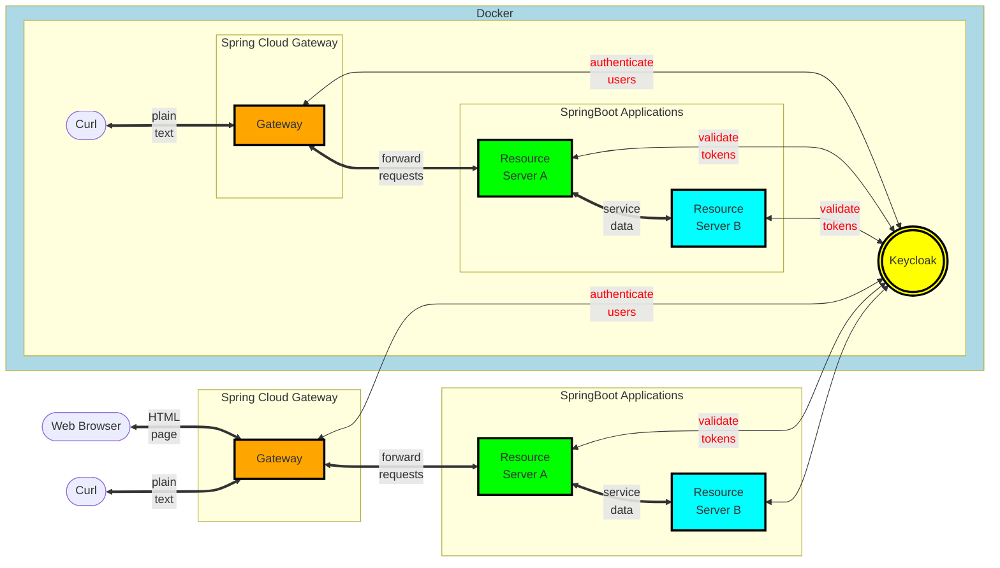

```mermaid
flowchart LR
    subgraph Docker
        subgraph " "
            CURL-D([Curl])
            subgraph Spring Cloud Gateway
                D-GAT[Gateway]:::orangeBox
            end
            subgraph SpringBoot Applications
                D-RSA[Resource<br> Server A]:::greenBox
                D-RSB[Resource<br> Server B]:::cyanBox
            end
            KCK(((Keycloak))):::yellowBox
        end
    end
    class Docker lightBlueBox
    subgraph Spring Cloud Gateway
        L-GAT[Gateway]:::orangeBox
    end
    subgraph SpringBoot Applications
        L-RSA[Resource<br> Server A]:::greenBox
        L-RSB[Resource<br> Server B]:::cyanBox
    end
    WBR([Web Browser])
    CURL([Curl])
%% Flows
    D-GAT <-- authenticate<br> users --> KCK
    D-RSA <-- validate<br> tokens --> KCK
    D-RSB <-- validate<br> tokens --> KCK
    L-GAT <-- authenticate<br> users --> KCK
    L-RSA <-- validate<br> tokens --> KCK
    L-RSB <--> KCK
    CURL-D <== plain<br> text ==> D-GAT
    WBR <== HTML<br> page ==> L-GAT
    CURL <== plain<br> text ==> L-GAT
    D-GAT <== forward<br> requests ==> D-RSA
    D-RSA <== service<br> data ==> D-RSB
    L-GAT <== forward<br> requests ==> L-RSA
    L-RSA <== service<br> data ==> L-RSB
%% Style Definitions
    linkStyle 0,1,2,3,4,5 color: red;
    classDef greenBox fill: #00ff00, stroke: #000, stroke-width: 3px
    classDef cyanBox fill: #00ffff, stroke: #000, stroke-width: 3px
    classDef yellowBox fill: #ffff00, stroke: #000, stroke-width: 3px
    classDef orangeBox fill: #ffa500, stroke: #000, stroke-width: 3px
    classDef lightBlueBox  fill: lightblue
```